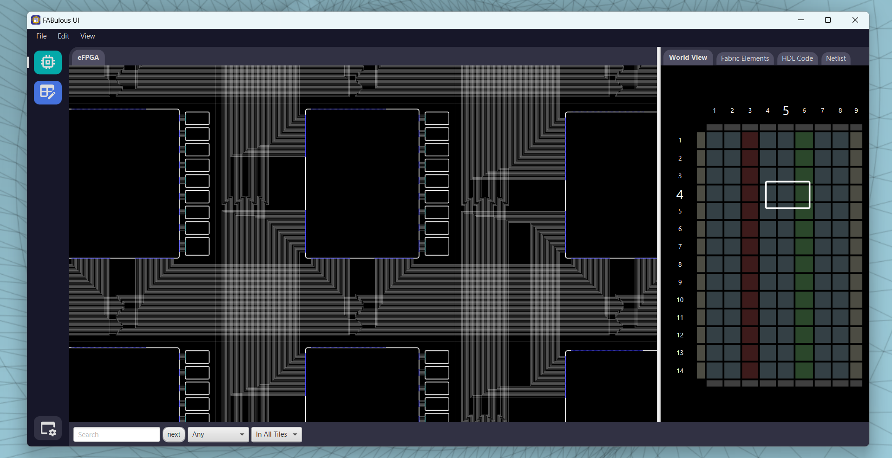

# -- WORK IN PROGRESS --

## FABulator 

This project aims to enable easy interactions with the FABulous Framework. 
To ensure this, FABulator offers exploring fabrics generated with FABulous, 
displaying user-designs, supports editing on both an architectural and 
user-design level and offers miscellaneous other features.

## Screenshots

## Features

- High Detail view of the generated fabric
- Easy creation of custom architectures using default tiles
- "Quality of life" utilities: Searching, regex-find, World View, easy navigation

## Work in Progress

This project is not yet available. Stay tuned for updates!